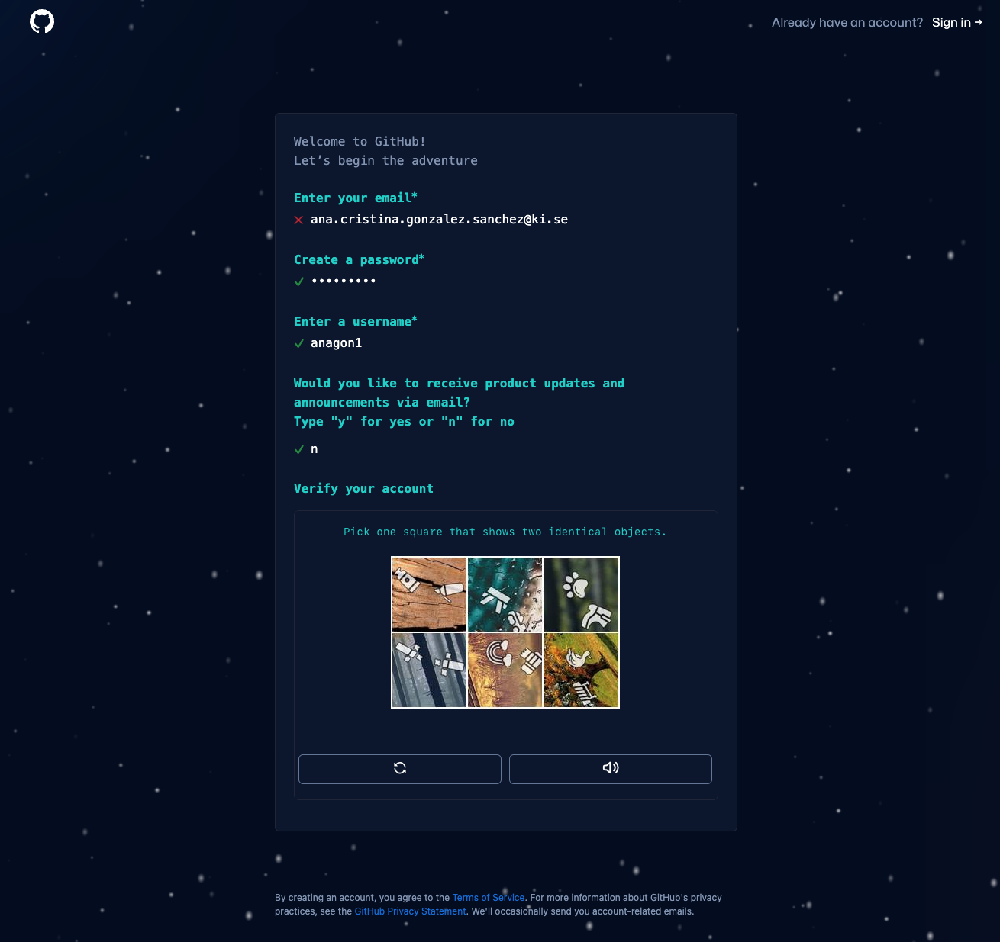
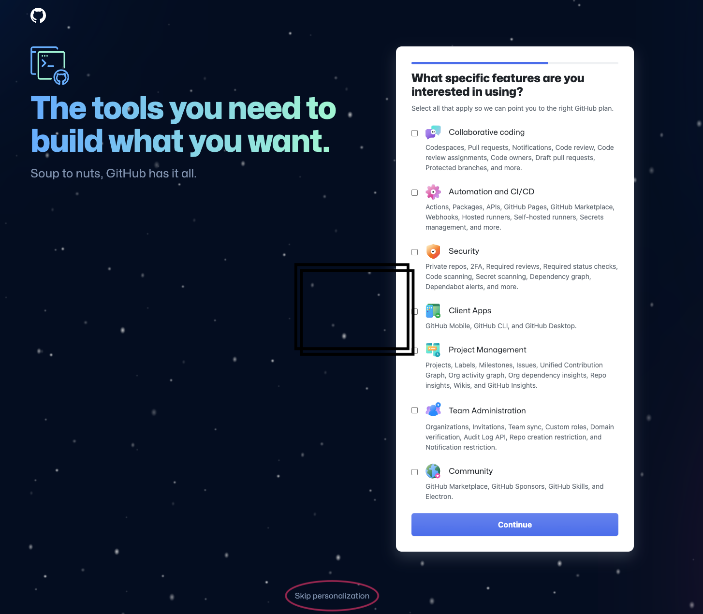
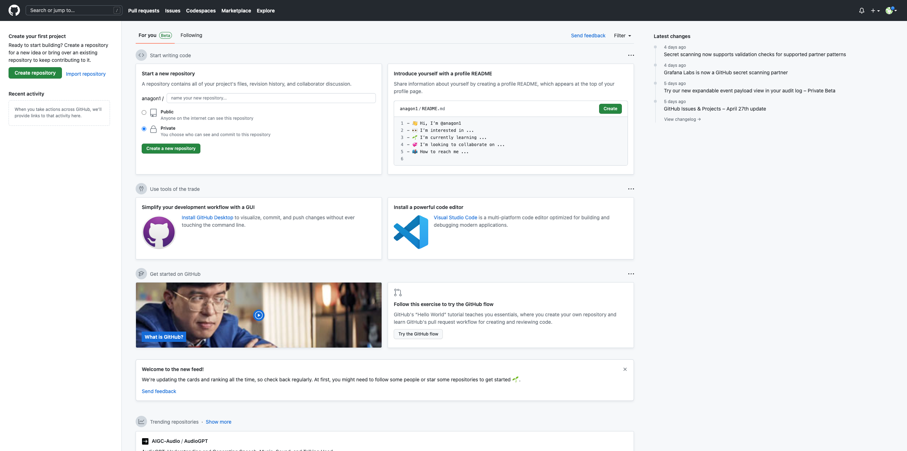

# GitHubIntro

>
Introduction to git - VT23  
> May 2023  

## Table of contents
1. [Create a github account](#githubacc)
	1. [Step 1](#step1)
	2. [Step 2](#step2)
  	3. [Step 3](#step3)
  	4. [Step 4](#step4)
2. [Create an SSH key](#sshkey)

## Create a new GitHub account 
To carry out some of the exercises we will need a github account. Following the instructions below to create one.

### Step 1: open GitHub
In a web browser uped [Github](www.github.com). You should see the same screen as in the image below:

<h3 align="center">

</h3>

Next input your email address and click on "Sign up for GitHub"

### Step 2: Fill out the information
Once you have clicked on the botton you will see the following screen:

<h3 align="center">

</h3>
Fill out the fields with your information:

* Enter your email: it is possible you cannot use your institutional email, but your personal email is ok too.
* Create a password: Try to use a password with at least 1 capital letter, 1 number, and 1 special character (e.g. !%$?). 
* Enter a username: very straightforward, just choose something you can easily remember.
* Opt in or out for anouncements: I chose n, but you can always choose y.
* Verify the account - So you prove you are not a robot (or ChatGPT).

<h3 align="center">

</h3>

### Step 3: personalization
Choose personalization options. If you want you can skip this step by clicking "Skip personalization" at the bottom of the page.
<h3 align="center">

</h3>

### Step 4: Done
If the previous instructions worked, you will now see a start page as the one in the image below.
<h3 align="center">

</h3>
Feel free to go around and explore!! we will use this soon for the exercises.

## Create and add SSH key 
In order to "link" our local directory with a remote directory in GitHub we will need to create a new SSH key, which will be used to securely authenticate ourselves everytime we are trying to make changes to our repositories (or others) repositories. Previously, you could use your password to authenticate yourself, but since 2022 it is no longer supported. 

Follow the instructions in the following link to create a new ssh key, add it to your agent and to your GitHub account. 

https://docs.github.com/en/authentication/connecting-to-github-with-ssh/generating-a-new-ssh-key-and-adding-it-to-the-ssh-agent
